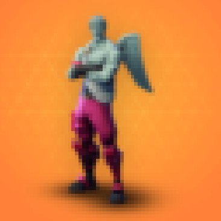
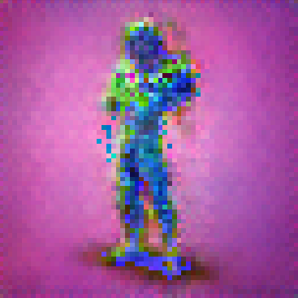

# this is not a Fortnite skin

> I don't have access to massive amounts of GPU power, which means
I had to use 64x64 resolution for this. By using 64x64 you lose most
of the detail of the skins.

## Results
_Real love ranger skin_

_Example of a Generated skin_

## About
An implementation of a DC-GAN that trains on Fortnite skins
in an attempt to generate new ones

## Usage 
Most of the modules at have a CLI that can be used to at each
step to reproduce the results.